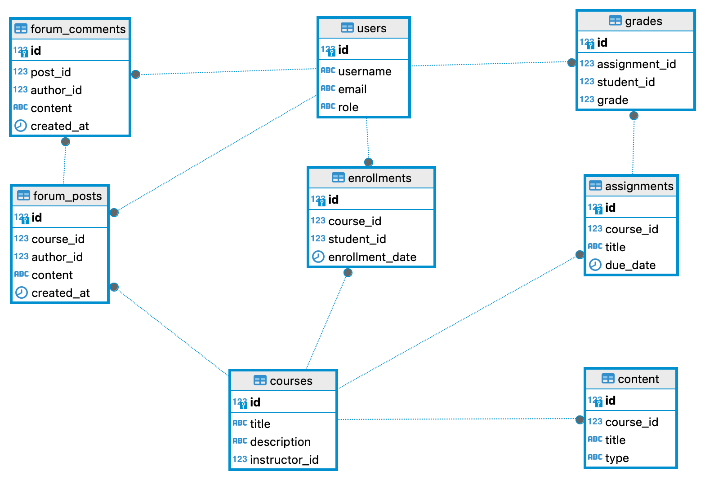

###  Online Learning Management System (LMS)

**Overview:**
You are tasked with building an online learning management system (LMS) that allows educational institutions to offer courses, students to enroll in courses, instructors to manage course content, and administrators to oversee the entire system.

**Requirements:**

1. **User Authentication API:**
    - Endpoint: `/api/auth`
    - Methods:
      - POST `/signup`, 
      - POST `/login`, 
      - POST `/logout`

2. **Course Management API:**
    - Endpoint: `/api/courses`
    - Methods:
      - GET `/` (get all courses), 
      - POST `/create` (create a new course), 
      - GET `/:id` (get course by id), 
      - PUT `/:id` (update course by id), 
      - DELETE `/:id` (delete course by id)

3. **Enrollment API:**
    - Endpoint: `/api/enrollments`
    - Methods: 
      - GET `/student/:studentId` (get all enrollments for a student),
      - POST `/enroll` (enroll student in a course), 
      - POST `/withdraw` (withdraw student from a course)

4. **Content Management API:**
    - Endpoint: `/api/content`
    - Methods: 
      - GET `/course/:courseId` (get all content for a course), 
      - POST `/course/:courseId` (create new content for a course), 
      - GET `/content/:id` (get content by id), 
      - PUT `/content/:id` (update content by id),
      - DELETE `/content/:id` (delete content by id)

5. **Assignment and Grading API:**
    - **Endpoint**: `/api/assignments`
    - Methods: 
      - GET `/course/:courseId` (get all assignments for a course),
      - POST `/course/:courseId` (create new assignment for a course), 
      - GET `/assignment/:id` (get assignment by id),
      - PUT `/assignment/:id` (update assignment by id), 
      - DELETE `/assignment/:id` (delete assignment by id)
      
    - **Endpoint**: `/api/grades`
      - Methods:
      - GET `/student/:studentId` (get all grades for a student), 
      - POST `/student/:studentId` (submit grade for a student), 
      - GET `/grade/:id` (get grade by id), 
      - PUT `/grade/:id` (update grade by id), 
      - DELETE `/grade/:id` (delete grade by id)

6. **Discussion Forum API:**
    - Endpoint: `/api/forum`
    - Methods:
      - GET `/course/:courseId` (get all forum posts for a course), 
      - POST `/course/:courseId` (create new forum post for a course), 
      - GET `/post/:id` (get post by id), 
      - PUT `/post/:id` (update post by id), 
      - DELETE `/post/:id` (delete post by id), 
      - POST `/comment/:postId` (add comment to a post), 
      - DELETE `/comment/:commentId` (delete comment by id)

7. **Notification API:**
    - Endpoint: `/api/notifications`
    - Methods: POST `/send` (send notifications to users about course updates, assignment deadlines, etc.)

8. **Dashboard and Reporting API:**
    - Endpoint: `/api/dashboard`
    - Methods: 
      - GET `/overview` (get overview of system, e.g., number of courses, students, etc.), 
      - GET `/reports` (generate reports based on various criteria)

**Additional Features (Optional):**

- Implement video conferencing for virtual classrooms.
- Include a quiz and assessment feature for courses.
- Integrate with external tools for plagiarism detection and content authoring.

**Submission Guidelines:**

- Provide the source code for both the frontend and backend components.
- Include a README file with instructions for setting up and running the application locally.
- Demonstrate the functionality of the application by recording a video walkthrough.

It will also assess their skills in frontend development using React and backend development using Spring boot and java 17.
For the Online Learning Management System (LMS) use case, the table relationship diagram would include entities such as `users`, `courses`, `enrollments`, `content`, `assignments`, `grades`, `forum_posts`, `forum_comments`, and `notifications`. Here's a simplified diagram illustrating the relationships between these entities:



```
+-----------------+          +----------------+          +----------------+
|     courses     |    1     |   enrollments   |     *    |      users     |
+-----------------+----------+----------------+----------+----------------+
| id              | <------> | id             |          | id             |
| title           |          | course_id      |          | username       |
| description     |          | student_id     |          | email          |
| instructor_id   |          | enrollment_date|          | role           |
+-----------------+          +----------------+          +----------------+
      |                           |       1
      |                           |
      |                           |
      |                           |
      |                           |
      |                           |
      |                           |
      |                           |
      |                           |
      |                           |
      |                           |
+-----------------+          +----------------+          +----------------+
|    assignments  |    *     |     content    |    1     |     grades     |
+-----------------+----------+----------------+----------+----------------+
| id              | <------> | id             | <------> | id             |
| course_id       |          | course_id      |          | assignment_id  |
| title           |          | title          |          | student_id     |
| due_date        |          | type           |          | grade          |
+-----------------+          +----------------+          +----------------+
      |                           |
      |                           |
      |                           |
      |                           |
      |                           |
      |                           |
      |                           |
      |                           |
      |                           |
      |                           |
+-----------------+          +----------------+          
|   forum_posts   |    *     | forum_comments | 
+-----------------+----------+----------------+
| id              | <------> | id             | 
| course_id       |          | post_id        | 
| author_id       |          | author_id      | 
| content         |          | content        | 
| created_at      |          | created_at     | 
+-----------------+          +----------------+
```

This diagram shows the relationships between the main entities in the LMS system. Users can be students or instructors, and they can enroll in courses. Courses have content, assignments, and forum posts. Assignments can have grades assigned to them. The forum posts can have comments associated with them.

Here's how we can create the schema that we described in PostgreSQL:

```roomsql

CREATE TABLE courses (
    id SERIAL PRIMARY KEY,
    title VARCHAR(255) NOT NULL,
    description TEXT,
    instructor_id INT NOT NULL
);

CREATE TABLE users (
    id SERIAL PRIMARY KEY,
    username VARCHAR(255) NOT NULL,
    email VARCHAR(255) NOT NULL,
    role VARCHAR(50) NOT NULL
);

CREATE TABLE enrollments (
    id SERIAL PRIMARY KEY,
    course_id INT NOT NULL,
    student_id INT NOT NULL,
    enrollment_date DATE NOT NULL,
    FOREIGN KEY (course_id) REFERENCES courses(id),
    FOREIGN KEY (student_id) REFERENCES users(id)
);

CREATE TABLE assignments (
    id SERIAL PRIMARY KEY,
    course_id INT NOT NULL,
    title VARCHAR(255) NOT NULL,
    due_date DATE NOT NULL,
    FOREIGN KEY (course_id) REFERENCES courses(id)
);

CREATE TABLE content (
    id SERIAL PRIMARY KEY,
    course_id INT NOT NULL,
    title VARCHAR(255) NOT NULL,
    type VARCHAR(50) NOT NULL,
    FOREIGN KEY (course_id) REFERENCES courses(id)
);

CREATE TABLE grades (
    id SERIAL PRIMARY KEY,
    assignment_id INT NOT NULL,
    student_id INT NOT NULL,
    grade DECIMAL(5,2) NOT NULL,
    FOREIGN KEY (assignment_id) REFERENCES assignments(id),
    FOREIGN KEY (student_id) REFERENCES users(id)
);

CREATE TABLE forum_posts (
    id SERIAL PRIMARY KEY,
    course_id INT NOT NULL,
    author_id INT NOT NULL,
    content TEXT NOT NULL,
    created_at TIMESTAMP DEFAULT CURRENT_TIMESTAMP,
    FOREIGN KEY (course_id) REFERENCES courses(id),
    FOREIGN KEY (author_id) REFERENCES users(id)
);

CREATE TABLE forum_comments (
    id SERIAL PRIMARY KEY,
    post_id INT NOT NULL,
    author_id INT NOT NULL,
    content TEXT NOT NULL,
    created_at TIMESTAMP DEFAULT CURRENT_TIMESTAMP,
    FOREIGN KEY (post_id) REFERENCES forum_posts(id),
    FOREIGN KEY (author_id) REFERENCES users(id)
);
```

This SQL code creates the necessary tables with their respective columns and foreign key 
constraints to maintain the relationships between them. Note that you might need to adjust
the data types and sizes based on your specific requirements.

